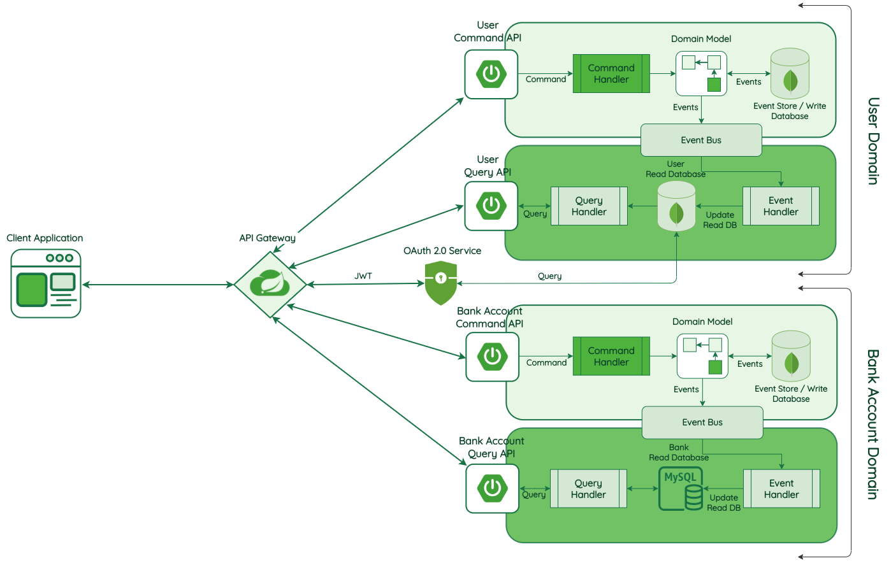

# evaluate-cqrs-event-sourcing
Evaluating the Command and Query Responsibility Segregation + Event Sourcing pattern 

Based on the Udemy course and implemented in Go: https://www.udemy.com/course/master-spring-boot-microservices-with-cqrs-event-sourcing/




## CQRS - Command and Query Responsibility Segregation

- The command API is capable to handle events for `create`, `update` and `delete`
- The query API is capable to handle events for `find`/`get` or `list`
- The Command handler is responsible to create the events in to append only store
- After command execution it will send the command the event to an event bus
- The Query event handler is then responsible to update the read database to the latest state of the entity received from the event based on the command
- CQRS makes the event store atomic and gives us the ability to replay the whole events
- The Read database can be seen as the production db
- Events are named in the past particle verb: https://www.grammar-monster.com/glossary/past_participles.htm

## Event Sourcing

- Each event is stored as a sequence immutable event in the event store
- Events are never modified

## Microservices
An MS should believe that it is the only service in the world

- Should not share code or data
- Avoid coupling between services and software
- Independence and autonomy are more important than code re-useabilty
- A service should be responsible for just one singe function or process
- Communication only via events/messages


## Run the Example

Start the docker-compose: 

```bash
docker-compose up --build
```

Insert a new user and update it:

```bash
curl -X POST http://localhost/users/ -d @example-data/user.json 
curl -X POST http://localhost/users/<id from response> -d @example-data/user-update.json 
```
